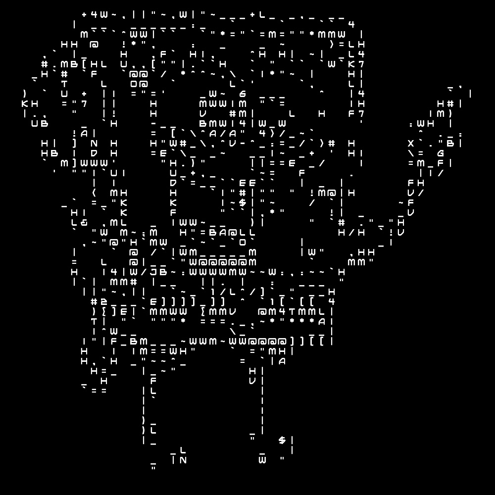

<h1>Image From Characters</h1>
Turns an image into an image built from command line characters. See ./examples from example transformation. create.py creates a transformed image and also prints out the image using command line characters. Image is first transformed into an image with edges using Pytorch HED, then transformed into an image made up of characters using a simple regression algorithm on sorted blocks. 
 
<h2>Input</h2>

 
<h2>Output</h2>

Example usage:
<code>
python3 create.py -i ./examples/bob.jpg -o ./examples/out.jpg -d True -n 50 -e True 
</code>

Use <code>
python3 create.py --help
</code>
for list of command line arguments

Note: since this algorithm uses a PyTorch based edging model, the model must be downloaded from https://github.com/sniklaus/pytorch-hed

run.py and ttf2png are adapted/forked from https://github.com/sniklaus/pytorch-hed and https://github.com/sl2/TTF-to-PNG respectively